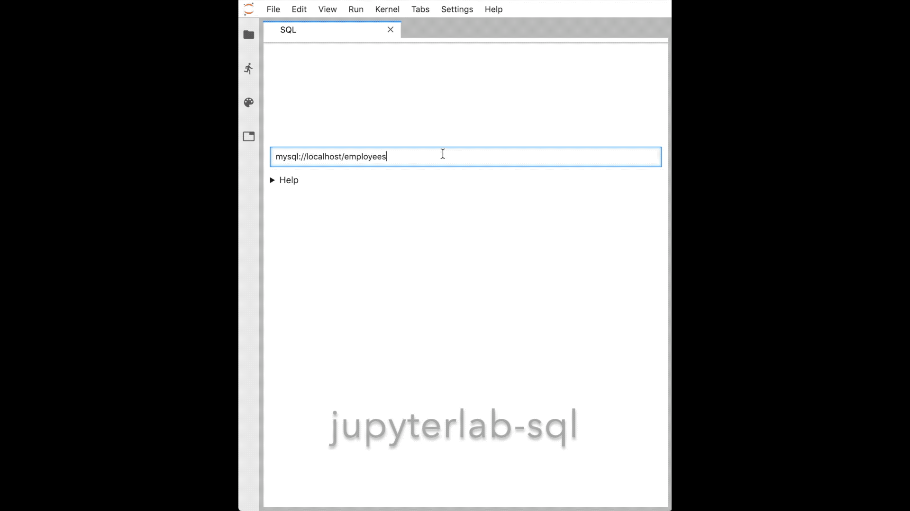
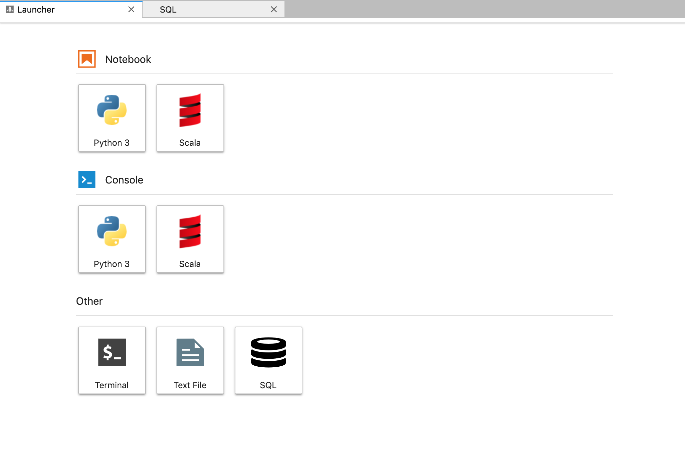

[](https://travis-ci.org/pbugnion/jupyterlab-sql)
[](https://pypi.python.org/pypi/jupyterlab-sql)

# jupyterlab-sql

*jupyterlab-sql* adds a SQL user interface to JupyterLab:

- explore your tables with a point-and-click interface
- read and modify your database with custom queries




## Installation

### Installing on JupyterLab 1.x

To install *jupyterlab-sql*, run the following commands:

```
pip install jupyterlab_sql
jupyter serverextension enable jupyterlab_sql --py --sys-prefix
jupyter lab build
```

You will then need to restart any running Jupyter servers.

*jupyterlab-sql* only works with Python 3.5 and above.

### JupyterLab legacy

To install jupyterlab-sql on versions of JupyterLab pre 1.0, run:

```
pip install jupyterlab_sql==0.2.1
jupyter serverextension enable jupyterlab_sql --py --sys-prefix
jupyter lab build
```

## Usage

### Starting a new SQL session

There is a SQL icon in the launcher (*File* > *New Launcher*):



You can also launch a session from the command palette: search for *SQL*.

### Formulating the connection URL

The connection URL needs to be a valid database URL. Follow the
[SQLAlchemy guide](https://docs.sqlalchemy.org/en/latest/core/engines.html#database-urls)
on database URLs.

### Executing statements

Press `shift` + `enter` or `ctrl` + `enter` while in the main query
area to dispatch the statement.

### Database support

*jupyterlab-sql* is tested against SQLite,
PostgreSQL, and MySQL databases.

Other databases supported by sqlalchemy may also work.

If you need support for other types of databases, see [issue
#113](https://github.com/pbugnion/jupyterlab-sql/issues/113).

### In-memory SQLite and persistence

The lifetime of a SQLite in-memory database is tied to the lifetime
of the Jupyter server. Restarting the Jupyter server will clear any
data in your in-memory database.

## Issue reporting and contributing

Report issues using the [issue
tracker](https://github.com/pbugnion/jupyterlab-sql/issues).

Contributions are welcome. If you have not developed JupyterLab
extensions before, I recommend following [this
tutorial](https://jupyterlab.readthedocs.io/en/stable/developer/xkcd_extension_tutorial.html).
